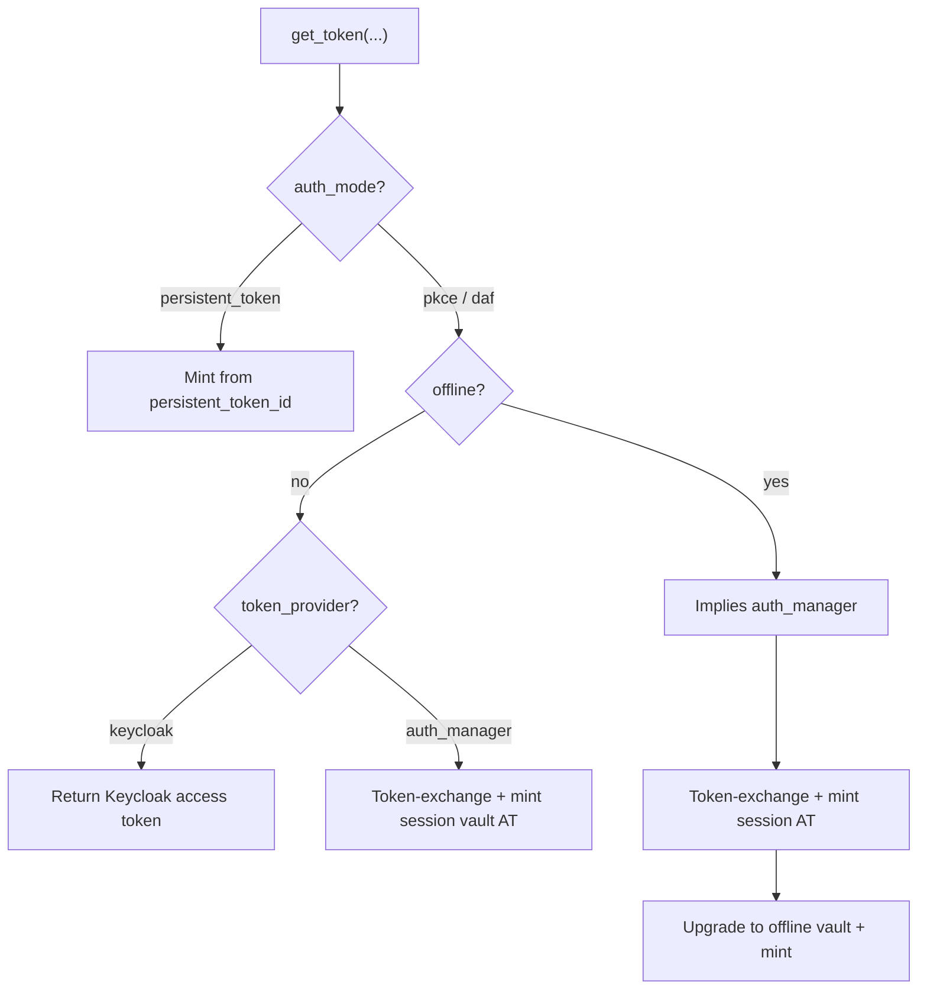

# obi-auth documentation

This directory describes how **obi-auth** obtains tokens from Keycloak and, optionally, from **auth-manager** (the token vault service).

> [!CAUTION]
> obi-auth is for interactive developer / tester use. Do not embed it as a long-running service identity.

## Contents

| Document | Topic |
| --- | --- |
| [Overview](overview.md) | Actors, environments, and how pieces fit together |
| [`get_token()`](get-token.md) | Parameter matrix and which flow each combination runs |
| [Vault & lifecycles](vault-and-lifecycles.md) | Refresh vs offline vault ids, expiry, reminting |
| [HTTP reference](http-api.md) | Requests obi-auth makes (paths, headers, responses) |
| [PKCE flow](flows/pkce.md) | Browser login via local callback |
| [Device auth (DAF)](flows/daf.md) | Device code login |
| [Session vault](flows/session-vault.md) | `token_provider=auth_manager` (token-exchange + mint) |
| [Offline vault](flows/offline-vault.md) | `offline=True` (consent + offline id + mint) |
| [Persistent token](flows/persistent-token.md) | Mint from a known vault uuid |

## Quick map

## Related services

- **Keycloak** — identity provider; issues access / refresh / offline tokens.
- **auth-manager** — encrypts refresh/offline tokens in a Postgres vault and mints fresh access tokens. Upstream docs live in the auth-manager repository (`README.md`).
