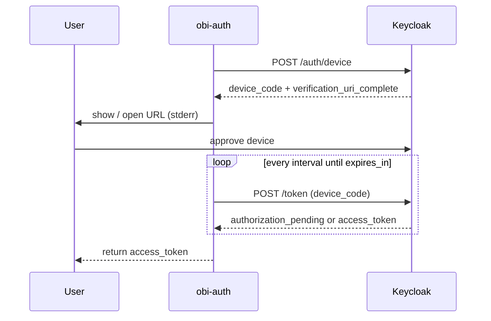

# Flow: Device Authorization (DAF)

Useful when the machine running obi-auth cannot easily complete a localhost redirect (SSH, remote IDE). The user approves on another device.

## `get_token()`

```python
from obi_auth import get_token

token = get_token(environment="staging", auth_mode="daf")
```

CLI: `obi-auth get-token -m daf`

Prompts (verification URL) are written to **stderr**; the access token is still the only stdout line when using the CLI.

## Steps

1. `POST` Keycloak device auth endpoint with `client_id` → `device_code`, `user_code`, `verification_uri_complete`, `interval`, `expires_in`.
2. Show the verification URL to the user (and open it when possible).
3. Poll token endpoint with `grant_type=urn:ietf:params:oauth:grant-type:device_code` until success or timeout (`expires_in / interval` attempts).
4. Cache and return `access_token`.



## Vault ids

None for `token_provider=keycloak`.

## With auth-manager

```python
get_token(auth_mode="daf", token_provider="auth_manager")
get_token(auth_mode="daf", offline=True)
```

Same vault behaviour as the PKCE-based session/offline docs; only the Keycloak login step changes.
