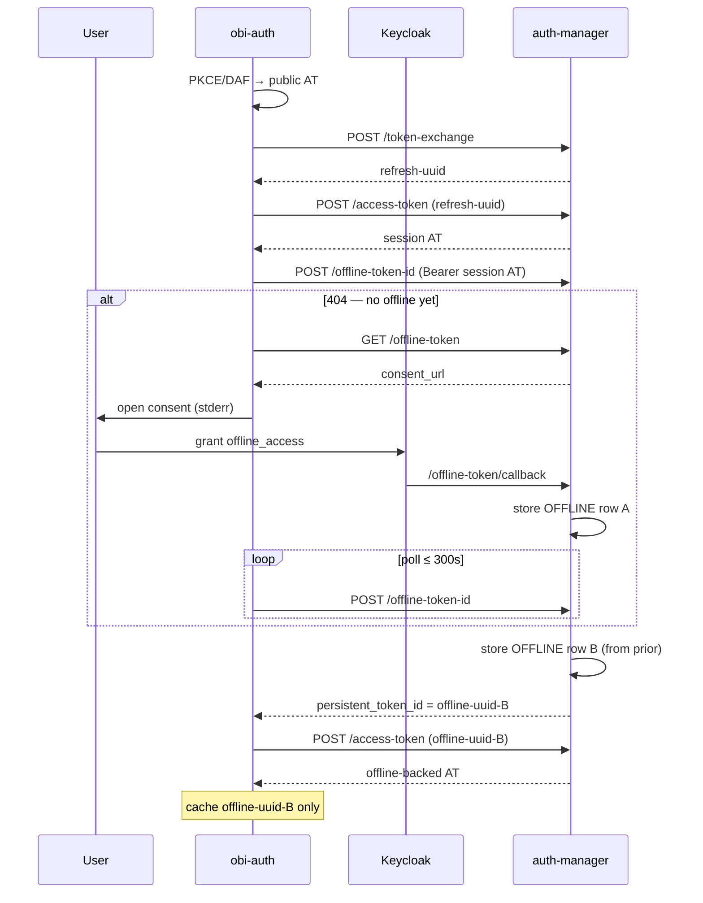

# Flow: Offline vault (`offline=True`)

Upgrades from a session (REFRESH) vault mint to an **OFFLINE** vault id (Keycloak `offline_access`), then mints an access token from that offline id. Intended for longer-lived reminting after the interactive session ends.

## `get_token()`

```python
from obi_auth import get_token

token = get_token(environment="staging", offline=True)
# implies token_provider="auth_manager"
# optional: auth_mode="daf"
```

CLI: `obi-auth get-token --offline`

Consent / status messages go to **stderr** so stdout stays a single JWT for piping.

## Steps

1. **Login** — public-client Keycloak AT (PKCE or DAF).
2. **Exchange** — `POST /token-exchange` → REFRESH uuid (upsert).
3. **Mint session AT** — `POST /access-token` with REFRESH uuid (Bearer for later offline calls).
4. **Resolve offline id** — `POST /offline-token-id` with that session AT:
   - **404** → first-time for this session: run consent (step 5), then poll again.
   - **200** → `{ "data": { "persistent_token_id": "<new-offline-uuid>" } }`  
     auth-manager **always inserts a new OFFLINE row** (linked via `attributes.from` to a prior offline entry for the session).
5. **Consent (only if 404)**  
   - `GET /offline-token` → `consent_url`  
   - Print URL + open browser  
   - User grants `offline_access` at Keycloak  
   - Keycloak hits auth-manager `GET /offline-token/callback` (stores first OFFLINE row)  
   - obi-auth polls `POST /offline-token-id` every 2s up to 300s  
6. **Mint offline AT** — `POST /access-token` with the offline uuid.
7. Cache under `{auth_mode}_auth_manager_offline` (separate from session cache).



## Vault ids

| Id | When | Cached by obi-auth? |
| --- | --- | --- |
| REFRESH uuid from token-exchange | Always in this flow | No (only used transiently) |
| OFFLINE row from consent callback | First consent for session | No (obi-auth does not read callback header) |
| OFFLINE uuid from `POST /offline-token-id` | Every successful upgrade | **Yes** |

So after a successful offline run you typically have **at least two** vault rows (REFRESH + OFFLINE), and often **two OFFLINE rows** (callback + clone from `/offline-token-id`).

## Lifecycle

| Artifact | Behaviour |
| --- | --- |
| Returned access token | Short-lived JWT; reminted from cached offline uuid |
| Offline vault id | Kept locally forever until remint fails or `force_refresh` |
| Keycloak offline token | Survives interactive logout per Keycloak policy; revoke via auth-manager `DELETE /offline-token-id` (not wrapped by obi-auth) |

## Implementation map

| Step | Code |
| --- | --- |
| Exchange + session mint | `auth_manager_exchange_token` |
| Offline upgrade | `auth_manager_upgrade_to_offline_token` |
| Consent wait | `auth_manager_request_and_await_offline_consent` |
| Orchestration | `_get_auth_manager_token(..., offline=True)` with separate try/except around upgrade |
