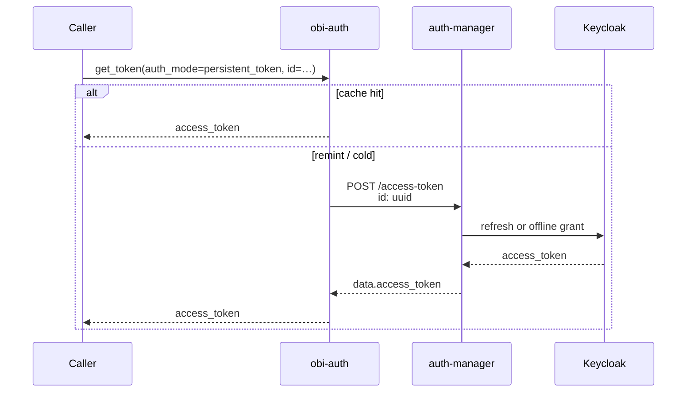

# Flow: Persistent token id

Mint an access token from a vault UUID you already have (REFRESH or OFFLINE). No Keycloak login and no token-exchange. Used by callers such as launch scripts that were handed an id out-of-band.

## `get_token()`

```python
from obi_auth import get_token

token = get_token(
    environment="staging",
    auth_mode="persistent_token",
    persistent_token_id="aaaaaaaa-bbbb-cccc-dddd-eeeeeeeeeeee",
)
```

CLI:

```sh
obi-auth get-token -m persistent_token --persistent-token-id <uuid>
```

`token_provider` and `offline` are ignored for this mode.

## Steps

1. Require `persistent_token_id`.
2. If local cache for that id has a valid AT → return it.
3. If AT expired but id is known → `POST /access-token` with header `id: <uuid>`.
4. Otherwise mint once and cache under a storage key equal to the uuid string.



## Vault ids

Does **not** create a vault id. The uuid must already exist in auth-manager (session REFRESH or OFFLINE). Wrong/revoked ids → mint failure → `ClientError`.

## Lifecycle

Same remint rules as other auth-manager paths: access token JWT expires; vault id is reused until Keycloak/auth-manager rejects it.

## Security note

Anyone who can read the uuid can mint tokens. Prefer injecting ids via a secret channel; do not commit them.
