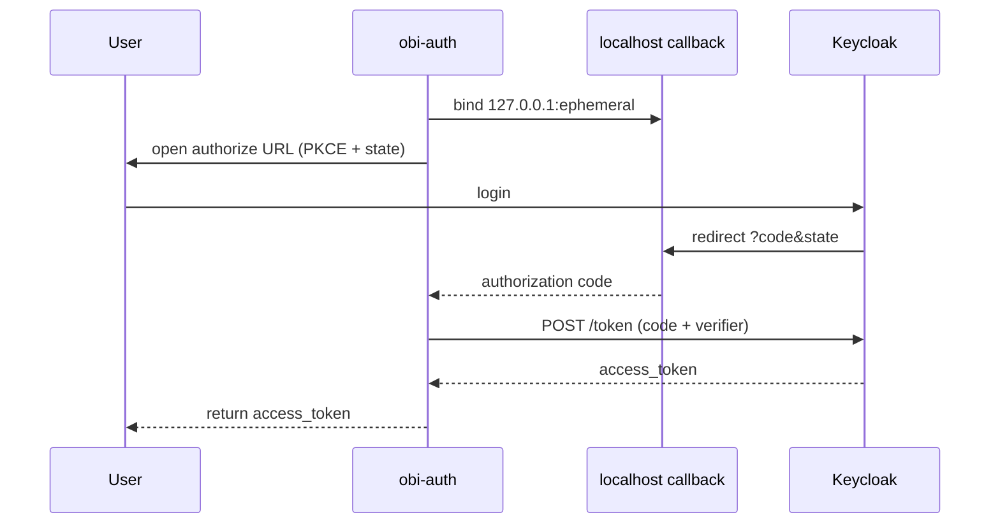

# Flow: PKCE (Keycloak)

Default `auth_mode` for interactive desktop use.

## `get_token()`

```python
from obi_auth import get_token

# Returns a Keycloak access token (azp = public client)
token = get_token(environment="staging")
# same as:
token = get_token(auth_mode="pkce", token_provider="keycloak")
```

CLI: `obi-auth get-token`

## Steps

1. Start a localhost HTTP callback server (ephemeral port).
2. Generate PKCE `code_verifier` / `code_challenge` and OAuth `state`.
3. Open the system browser to Keycloak authorize URL (`scope=openid`, `code_challenge_method=S256`, default `kc_idp_hint=github`).
4. User signs in; Keycloak redirects to `http://127.0.0.1:<port>/callback?code=…&state=…`.
5. Server verifies `state`, returns `code` to the client.
6. `POST` token endpoint with authorization code + `code_verifier`.
7. Cache and return `access_token`.



## Vault ids

None. No auth-manager calls.

## Lifecycle

- Access token: JWT `exp` (cached until near expiry).
- On expiry / `force_refresh`: full browser login again.

## Combined with auth-manager

PKCE is also the default login step before session or offline vault flows when `auth_mode="pkce"`.
