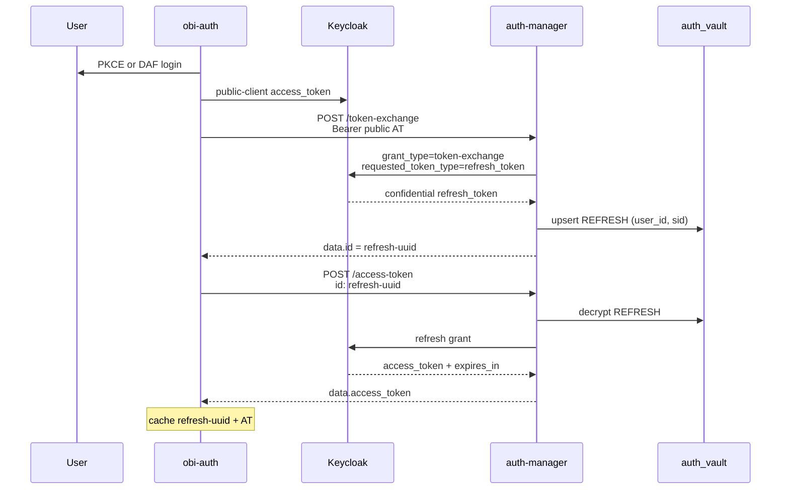

# Flow: Session vault (`token_provider=auth_manager`)

Registers a **REFRESH** vault entry via token-exchange, then mints an access token from that id. Suitable for short/medium interactive work while the Keycloak session remains valid.

## `get_token()`

```python
from obi_auth import get_token

token = get_token(
    environment="staging",
    token_provider="auth_manager",
)
# optional: auth_mode="daf"
```

CLI: `obi-auth get-token -p auth_manager`

## Steps

1. Obtain a **public-client** Keycloak access token (PKCE or DAF).
2. `POST /api/auth-manager/v1/token-exchange`  
   `Authorization: Bearer <public AT>`  
   → `{ "data": { "id": "<refresh-uuid>" } }`  
   auth-manager exchanges with Keycloak for a confidential-client refresh token and **upserts** a REFRESH row (same uuid for same user+session).
3. `POST /api/auth-manager/v1/access-token`  
   header `id: <refresh-uuid>`  
   → `{ "data": { "access_token", "expires_in" } }`
4. Cache encrypted AT + vault id under key `{auth_mode}_auth_manager`.
5. Return the access token.



## Vault ids created / reused

| Id | Type | Behaviour |
| --- | --- | --- |
| `data.id` from token-exchange | REFRESH | **Reused** on upsert for the same Keycloak session; new session → new row |

Only this REFRESH id is cached by obi-auth for this flow.

## Lifecycle

| Event | Behaviour |
| --- | --- |
| AT still valid in local cache | Return cached AT |
| AT expired | Remint with same refresh-uuid (`POST /access-token`) |
| Remint fails (session dead, revoked, …) | Clear cache → login + exchange again |
| `force_refresh=True` | Clear cache → full flow |

## Implementation map

| Step | Code |
| --- | --- |
| Login | `pkce_authenticate` / `daf_authenticate` |
| Exchange + mint | `auth_manager_exchange_token` → `_auth_manager_exchange_persistent_id` + `auth_manager_mint_access_token` |
| Orchestration | `_get_auth_manager_token(..., offline=False)` |
