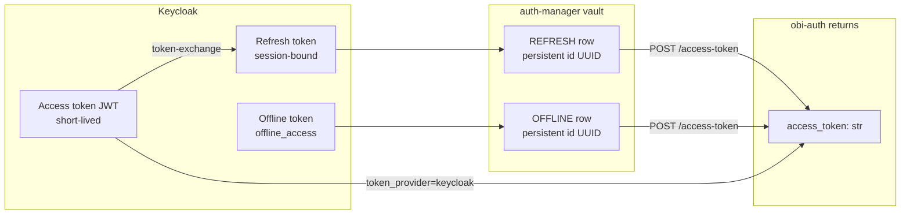

# Overview

## Actors

| Actor | Role |
| --- | --- |
| **User** | Completes browser or device login (and offline consent when asked). |
| **obi-auth** | Interactive Python / CLI client (public Keycloak client `obi-entitysdk-auth` by default). |
| **Keycloak** | Issues OIDC tokens for the realm (e.g. `SBO`). |
| **auth-manager** | Vault service: stores encrypted Keycloak refresh/offline tokens; mints access tokens via Keycloak. |
| **Local disk cache** | Encrypted token files under `~/.config/obi-auth/` (or `OBI_AUTH_CONFIG_DIR`). |

## Environments

`environment` selects staging vs production domain prefixes used by obi-auth:

| Environment | Domain used by obi-auth |
| --- | --- |
| `staging` (default) | `https://staging.cell-a.openbraininstitute.org` |
| `production` | `https://cell-a.openbraininstitute.org` |

Keycloak URLs are under `/auth/realms/SBO/...`.  
auth-manager URLs used by obi-auth are under `/api/auth-manager/v1/...` (gateway path; the service itself mounts routes at `/v1/...`).

## Two layers of tokens

**obi-auth always returns an access token string** (a JWT). When using auth-manager it also caches a **persistent vault id** so it can remint after the access token expires without a full login (as long as the vaulted Keycloak token is still valid).

## Why auth-manager exists for obi-auth

obi-auth authenticates as a **public** Keycloak client. It cannot hold the confidential client secret used by apps like the core web app. auth-manager’s `POST /token-exchange` takes the public-client access token, performs Keycloak **standard token exchange** as the confidential client, stores the resulting **refresh** token in the vault, and returns a UUID. Later `POST /access-token` with that UUID yields a fresh access token minted through Keycloak.

Offline access adds a second vault type (`OFFLINE`) backed by Keycloak’s `offline_access` scope, so jobs can remint after the user’s interactive session ends.

## What this library does *not* do

- It does not implement auth-manager’s NextAuth / direct `POST /refresh-token` path (confidential client already has a refresh token).
- It does not call `DELETE /offline-token-id` (revocation).
- It does not call `POST /refresh-token-id` (resolve refresh id by Bearer session).
- It does not run as a background service identity.
