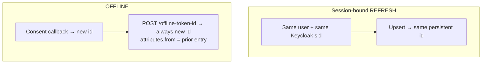
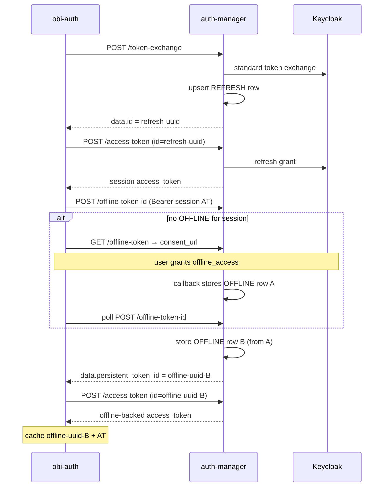
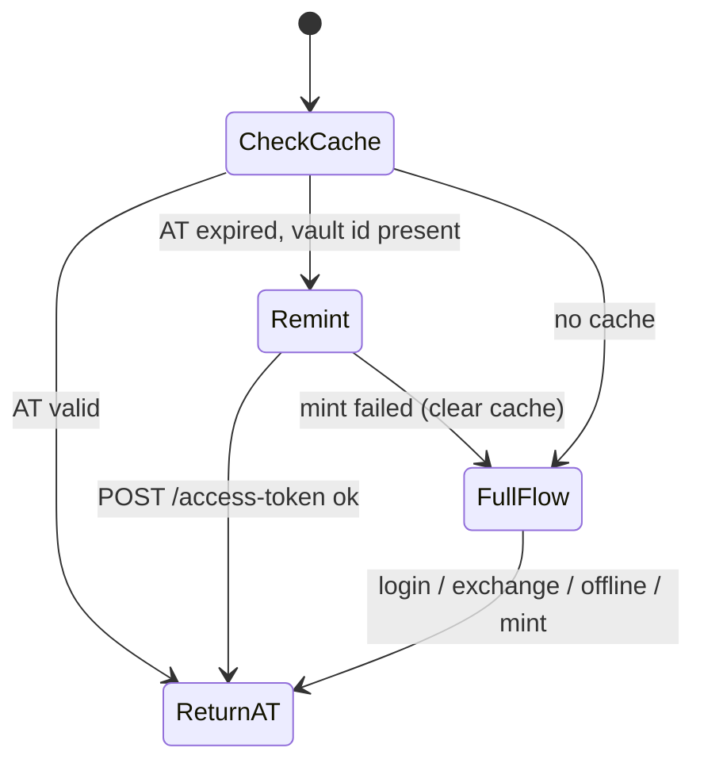

# Vault ids and lifecycles

auth-manager stores Keycloak tokens in Postgres (`auth_vault`), encrypted at rest (AES-256-CBC). Clients never see the raw refresh/offline string; they hold a **persistent token id** (UUID) and call `POST /access-token` with header `id: <uuid>`.

## Vault row types

| `token_type` | Keycloak material | Uniqueness | Typical creator |
| --- | --- | --- | --- |
| **REFRESH** | Confidential-client refresh token (`typ` ≈ Refresh) | One row per `(user_id, session_state_id)` — **upsert** reuses the same UUID | `POST /token-exchange`, `POST /refresh-token`, … |
| **OFFLINE** | Offline token (`offline_access`; still delivered as `refresh_token` in KC responses) | **Many rows** allowed; each `store()` inserts a **new** UUID | Consent callback; `POST /offline-token-id` clones |

## What expires?

| Artifact | Expires? | Who decides |
| --- | --- | --- |
| **Access token** returned by `get_token` | **Yes** — JWT `exp` (often ~1 hour) | Keycloak client/realm policy |
| **obi-auth local cache of access token** | Yes — Fernet TTL from JWT `exp` minus `EPSILON_TOKEN_TTL_SECONDS` (60s) | obi-auth |
| **REFRESH vault row** | No local TTL column; dies when Keycloak refresh is invalid / session ends | Keycloak |
| **OFFLINE vault row** | No local TTL column; dies when Keycloak offline token is revoked/invalid | Keycloak |
| **Persistent id UUID** | Lives until vault delete / remint failure | auth-manager DB |

Vault rows do **not** have an expiry timestamp in auth-manager. When Keycloak rejects a refresh/offline grant, `POST /access-token` fails (typically surfaced as an HTTP error → obi-auth clears cache and re-auths).

## Two ids after a full offline first run

A cold `get_token(offline=True)` typically leaves **both**:

1. A **REFRESH** id from `POST /token-exchange` (upsert for that session). Used only to mint a short-lived access token that authorizes offline endpoints.
2. An **OFFLINE** id from `POST /offline-token-id` (always a new insert; may also have created another OFFLINE row in the consent callback). **This** is what obi-auth caches under `*_auth_manager_offline`.

## Remint lifecycle in obi-auth

`force_refresh=True` jumps straight to clearing the local file and running the full flow.

## Possession of the UUID

`POST /access-token` (and offline revoke) authorize by **knowing the vault UUID**. Treat persistent ids like secrets: anyone with the id can mint access tokens until the underlying Keycloak token is invalid or the row is deleted.
